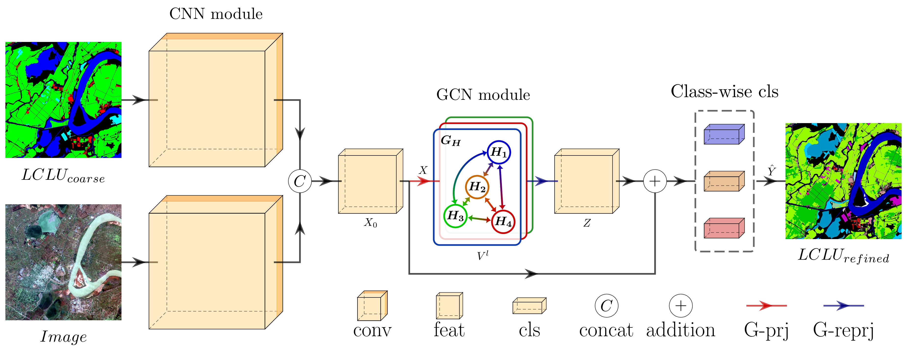

# GHGCN

Implementation for: [Global Heterogeneous Graph Convolutional Network: From Coarse to Refined Land Cover and Land Use Segmentation](https://www.tandfonline.com/doi/10.1080/17538947.2024.2353110).



## Abstract

The abundant details embedded in very-high-resolution remote sensing images establish a solid foundation for comprehending the land surface. Simultaneously, as spatial resolution advances, there is a corresponding escalation in the required granularity of land cover and land use (LCLU) categories. The coarse classes identified necessitate further refinement into more detailed categories. For instance, the ‘built-up’ class can be subdivided into specific categories such as squares, stadiums, and airports. These refined LCLU classifications are better equipped to support diverse domains. Nonetheless, most studies simply adopt methods initially designed for coarse LCLU when addressing the challenging refined LCLU segmentation. Few studies have considered the inherent relationships between coarse and refined LCLU, overlooking the potential exploitation of the numerous recently released LCLU products. To better leverage this prior knowledge, we propose the Global Heterogeneous Graph Convolutional Network (GHGCN). The GHGCN introduces a heterogeneous graph and excels in establishing relationships between coarse and refined LCLU, which can extract long-distance dependencies more effectively than convolutional neural networks. Furthermore, this model is performed end-to-end, eliminating the necessity for presegmentation and facilitating training acceleration. GHGCN exhibits competitive performance compared to state-of-the-art models, indicating its effective design in exploiting coarse LCLU data, especially for categories with limited samples. The source code is released at: https://github.com/Liuzhizhiooo/GHGCN.

## Software

package installation

```sh
pip install -r ./requirements.txt
```

## Train & Evaluate

The pretrained ResNet50 can be downloaded in this [link](https://download.pytorch.org/models/resnet50-0676ba61.pth), and put it in path `./models/resnet/`.

`train model`

```sh
# GID15
python main.py train --train=True --labelName=GID15 --model=GHGCN --tag=GID15-GHGCN
# GID24
python main.py train --train=True --labelName=GID24 --model=GHGCN --tag=GID24-GHGCN
```


`test model`

The input parameter `testModel` is selected according to the results of validation dataset, e.g. `epochs_50.pth`.

```sh
# GID15
python main.py test --labelName=GID15 --model=GHGCN --tag=GID15-GHGCN --testModel=xxx
# GID24
python main.py test --labelName=GID24 --model=GHGCN --tag=GID24-GHGCN --testModel=xxx
```

## Best Model

We provide the model files (.pth) used to report the performance of GHGCN in our paper, which can be downloaded from the link below:

+ Link: [Baidu drive](https://pan.baidu.com/s/1PzrYiBgz2pAQb8HtsUKtEA) (extraction code: GHGC)
+ Link: [Google drive](https://drive.google.com/drive/folders/16iTfRbtTI2kUbmLD20fIgmcJczwaqcJ3?usp=sharing)

The results of GHGCN in our paper can be reproduced by the following command:

```sh
# GID15
python main.py test --labelName=GID15 --model=GHGCN --tag=GID15-GHGCN --testModel=epochs_50.pth
# GID24
python main.py test --labelName=GID24 --model=GHGCN --tag=GID24-GHGCN --testModel=epochs_50.pth
```

## Dataset

The image and label data can be downloaded from [GID5](https://x-ytong.github.io/project/GID.html), [GID15](https://captain-whu.github.io/HPS-Net/), and [GID24](https://x-ytong.github.io/project/Five-Billion-Pixels.html). We recommend generating GID5 and GID15 labels from GID24 labels using the hierarchical category system, as GID24 labels are more up-to-date.

The detail information about this dataset can be found in [GHGCN](https://www.tandfonline.com/doi/10.1080/17538947.2024.2353110).

We provide the data division in `./dataset/division`, where each row follows the naming convention `filename-xoff-yoff.tif`.

```python
./dataset
├─__init__.py
├─datasetCNNLC.py  # Dataset
├─RasterToolbox.py  # function tool
├─divide  # data division
│  ├─MeanStdArr.npy  # data norm para
│  ├─train.txt  # training
│  ├─val.txt  # validation
│  └─test.txt  # test
│
└─data  # data
    ├─img  # images
    ├─label-5  # GID5 label
    ├─label-15  # GID15 label
    └─label-24  # GID24 label
```


## Citation

If this code helps in your work, please consider citing us.

```
Liu, Zhi-Qiang, Zheng Zhang, Yu Meng, and Ping Tang. “Global Heterogeneous Graph Convolutional Network: From Coarse to Refined Land Cover and Land Use Segmentation.” International Journal of Digital Earth 17, no. 1 (2024). https://doi.org/10.1080/17538947.2024.2353110.

Liu, Zhi-Qiang, Ping Tang, Weixiong Zhang, and Zheng Zhang. “CNN-Enhanced Heterogeneous Graph Convolutional Network: Inferring Land Use from Land Cover with a Case Study of Park Segmentation.” Remote Sensing 14, no. 19 (2022): 5027. https://doi.org/10.3390/rs14195027.
```

or

```
@Article{doi:10.1080/17538947.2024.2353110,
AUTHOR = {Liu, Zhi-Qiang, Zhang Zheng, Meng Yu and Tang Ping},
TITLE = {Global heterogeneous graph convolutional network: from coarse to refined land cover and land use segmentation},
JOURNAL = {International Journal of Digital Earth},
VOLUME = {17},
NUMBER = {1},
PAGES = {2353110},
YEAR = {2024},
PUBLISHER = {Taylor \& Francis},
DOI = {10.1080/17538947.2024.2353110},
URL = {https://doi.org/10.1080/17538947.2024.2353110},
EPRINT = {https://doi.org/10.1080/17538947.2024.2353110}
}

@Article{rs14195027,
AUTHOR = {Liu, Zhi-Qiang and Tang, Ping and Zhang, Weixiong and Zhang, Zheng},
TITLE = {CNN-Enhanced Heterogeneous Graph Convolutional Network: Inferring Land Use from Land Cover with a Case Study of Park Segmentation},
JOURNAL = {Remote Sensing},
VOLUME = {14},
YEAR = {2022},
NUMBER = {19},
ARTICLE-NUMBER = {5027},
URL = {https://www.mdpi.com/2072-4292/14/19/5027},
ISSN = {2072-4292},
DOI = {10.3390/rs14195027}
}
```


## License

The code and the models are MIT licensed, as found in the LICENSE file.
